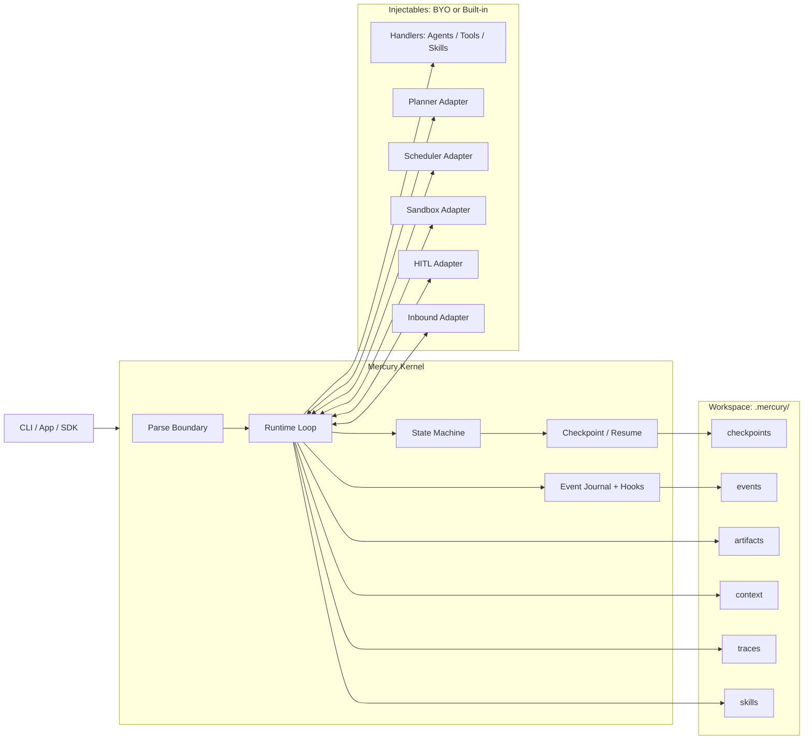
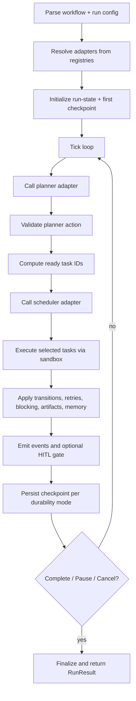
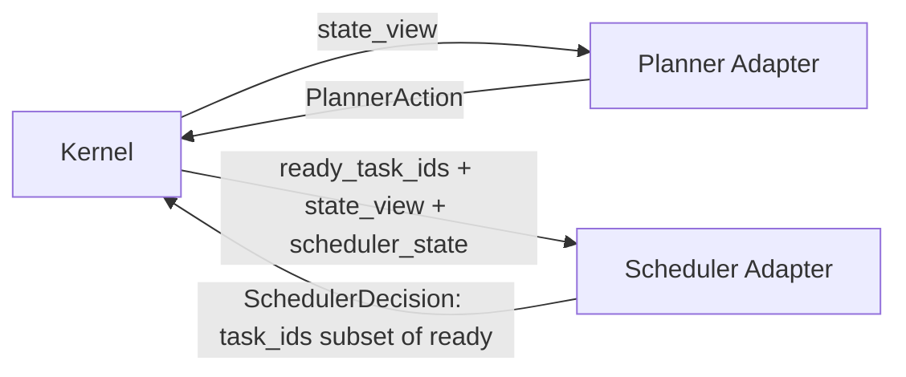

# Mercury

Mercury is a minimal, kernel-first multi-agent runtime for DAG execution.

It is designed for strong runtime correctness (state machine, retries, checkpoint/resume, contract enforcement) without committing to one planner, one scheduler, one sandbox, or one tool stack.
The runtime nucleus is stable, while execution policy is dynamic per run through adapter IDs and typed configs.

## Why Mercury Exists

Most orchestration stacks force behavior and correctness into the same layer.
Mercury splits them:

- Kernel: correctness and invariants.
- Adapters: behavior and policy.

This gives you:

- Deterministic execution semantics.
- Swappable strategy per run.
- A stable runtime core while your agent ecosystem evolves.
- Dynamic policy selection at runtime without changing kernel code.

## Design Decisions (and Why)

### 1) Kernel-first, adapter-driven

Decision:
- Keep planner, scheduler, sandbox, HITL, and inbound integration as adapters resolved by ID.

Why:
- No privileged planner path.
- Runtime behavior is replaceable without kernel edits.
- Easier long-term support for heterogeneous agent/tool ecosystems.

Tradeoff:
- More explicit registration/config upfront.

### 2) Parse once at boundaries, typed domain inside

Decision:
- Use Pydantic only at boundaries (`workflow`, planner/scheduler actions, inbound events, checkpoints).
- Convert once to internal domain types (dataclasses/enums) and operate on those.

Why:
- Strong input discipline and deterministic parse errors.
- Avoid repeated re-validation inside hot runtime paths.
- Keeps kernel logic explicit and easier to reason about.

Tradeoff:
- You maintain conversion code between schema and domain.

### 3) DAG model

Decision:
- Keep a static DAG for the run; compute ready-set from dependency status.

Why:
- Clear scheduling semantics.
- Deterministic resume.
- Minimal core complexity.

Tradeoff:
- No dynamic DAG mutation in v2.

### 4) Scheduler as a true seam

Decision:
- Scheduler only selects from ready task IDs.
- Scheduler state is persisted in checkpoints and restored on resume.

Why:
- Swappable scheduling policy without changing task semantics.
- Deterministic continuation after interruption.

Tradeoff:
- Scheduler cannot bypass dependency/readiness rules.

### 5) Explicit durability policy

Decision:
- Per-run durability mode: `sync`, `async`, `exit`.

Why:
- Operators choose consistency vs throughput explicitly.
- Same kernel behavior across local development and production.

Tradeoff:
- `async` and `exit` accept larger loss windows between durable writes.

### 6) Hooks are observability-only

Decision:
- Lifecycle hooks are read-only.

Why:
- Observability should not mutate core behavior.
- Behavior changes belong to adapters with explicit contracts.

Tradeoff:
- Less flexibility in hooks, but fewer hidden side effects.

## Core Features

- Async DAG runtime with dependency-aware scheduling.
- Handler primitives under one contract:
  - Agents
  - Tools
  - Skills
- Adapter seams:
  - Planner
  - Scheduler
  - Sandbox
  - HITL
  - Inbound adapter
- Dedicated sandbox support with swappable execution backends (`host`, `docker`, or custom).
- Programmatic tool calling as a first-class runtime primitive through typed tool handlers.
- Strict planner action contract:
  - `ENQUEUE(task_ids)`
  - `NOOP`
  - `COMPLETE(final_artifact_id)`
- Retry with exponential backoff and optional fallback output.
- Failure propagation (`failed` -> dependent `blocked`).
- Lifecycle states:
  - `pending`
  - `running`
  - `succeeded`
  - `failed`
  - `cancelled`
  - `blocked`
  - `paused`
- Checkpoint/resume with scheduler-state restoration.
- Append-only JSONL event journal per run.
- Read-only lifecycle hooks.
- Built-in adapters:
  - planners: `rules`, `rules_pydanticai`
  - schedulers: `superstep`, `ready_queue`
  - sandboxes: `host`, `docker`
  - hitl: `none`, `cli_gate`

## Dynamic Runtime Nucleus

Mercury keeps kernel invariants fixed, but makes runtime behavior configurable at execution time.

Per-run dynamic knobs:

- `planner_id` + `planner_config`
- `scheduler_id` + `scheduler_config`
- `sandbox_id` + `sandbox_config`
- `hitl_id` + `hitl_config`
- `inbound_adapter_id` + `inbound_adapter_config`
- `max_concurrency`
- `durability_mode` (`sync` / `async` / `exit`)

This means you can run the same workflow with different execution policies by changing only config, not kernel logic.
Unknown plugin IDs fail fast before execution starts.

## How Mercury Is Structured

### Kernel owns correctness

Kernel responsibilities:

- Parse/validate boundaries.
- Maintain run-state and lifecycle transitions.
- Enforce planner/scheduler/sandbox/HITL contracts.
- Apply retries, fallback, blocking, cancellation.
- Persist checkpoints and event journal.
- Resume deterministically.

### Ecosystem owns behavior

Adapter and handler responsibilities:

- Planner decides what to enqueue and when to complete.
- Scheduler chooses among ready tasks.
- Sandbox decides execution environment.
- HITL decides pause gates.
- Inbound adapters map external inputs into canonical events.
- Handlers (agents/tools/skills) implement business behavior.

## Mercury Diagrams

### 1) Kernel + Ecosystem Topology



### 2) Runtime Tick Lifecycle



### 3) Planner/Scheduler Contract Boundary

```mermaid
flowchart LR
    K[Kernel]
    P[Planner Adapter]
    S[Scheduler Adapter]

    K -->|state_view| P
    P -->|PlannerAction| K
    K -->|ready_task_ids + state_view + scheduler_state| S
    S -->|SchedulerDecision(task_ids subset of ready)| K
```

## Public API

From `mercury`:

- `run_flow(...) -> RunResult`
- `resume_flow(...) -> RunResult`
- `inspect_run(checkpoint_path) -> dict`
- `cancel_run(run_id) -> None`
- Registrations:
  - `register_agent`
  - `register_tool`
  - `register_skill`
  - `register_planner`
  - `register_scheduler`
  - `register_sandbox`
  - `register_hitl`
  - `register_inbound_adapter`
  - `register_hook`

## Quick Start

### 1) Install

## Why Mercury Exists

Most orchestration stacks force behavior and correctness into the same layer.
Mercury splits them:

- Kernel: correctness and invariants.
- Adapters: behavior and policy.

This gives you:

- Deterministic execution semantics.
- Swappable strategy per run.
- A stable runtime core while your agent ecosystem evolves.
- Dynamic policy selection at runtime without changing kernel code.

## Design Decisions (and Why)

### 1) Kernel-first, adapter-driven

Decision:
- Keep planner, scheduler, sandbox, HITL, and inbound integration as adapters resolved by ID.

Why:
- No privileged planner path.
- Runtime behavior is replaceable without kernel edits.
- Easier long-term support for heterogeneous agent/tool ecosystems.

Tradeoff:
- More explicit registration/config upfront.

### 2) Parse once at boundaries, typed domain inside

Decision:
- Use Pydantic only at boundaries (`workflow`, planner/scheduler actions, inbound events, checkpoints).
- Convert once to internal domain types (dataclasses/enums) and operate on those.

Why:
- Strong input discipline and deterministic parse errors.
- Avoid repeated re-validation inside hot runtime paths.
- Keeps kernel logic explicit and easier to reason about.

Tradeoff:
- You maintain conversion code between schema and domain.

### 3) DAG model

Decision:
- Keep a static DAG for the run; compute ready-set from dependency status.

Why:
- Clear scheduling semantics.
- Deterministic resume.
- Minimal core complexity.

Tradeoff:
- No dynamic DAG mutation in v2.

### 4) Scheduler as a true seam

Decision:
- Scheduler only selects from ready task IDs.
- Scheduler state is persisted in checkpoints and restored on resume.

Why:
- Swappable scheduling policy without changing task semantics.
- Deterministic continuation after interruption.

Tradeoff:
- Scheduler cannot bypass dependency/readiness rules.

### 5) Explicit durability policy

Decision:
- Per-run durability mode: `sync`, `async`, `exit`.

Why:
- Operators choose consistency vs throughput explicitly.
- Same kernel behavior across local development and production.

Tradeoff:
- `async` and `exit` accept larger loss windows between durable writes.

### 6) Hooks are observability-only

Decision:
- Lifecycle hooks are read-only.

Why:
- Observability should not mutate core behavior.
- Behavior changes belong to adapters with explicit contracts.

Tradeoff:
- Less flexibility in hooks, but fewer hidden side effects.

## Core Features

- Async DAG runtime with dependency-aware scheduling.
- Handler primitives under one contract:
  - Agents
  - Tools
  - Skills
- Adapter seams:
  - Planner
  - Scheduler
  - Sandbox
  - HITL
  - Inbound adapter
- Dedicated sandbox support with swappable execution backends (`host`, `docker`, or custom).
- Programmatic tool calling as a first-class runtime primitive through typed tool handlers.
- Strict planner action contract:
  - `ENQUEUE(task_ids)`
  - `NOOP`
  - `COMPLETE(final_artifact_id)`
- Retry with exponential backoff and optional fallback output.
- Failure propagation (`failed` -> dependent `blocked`).
- Lifecycle states:
  - `pending`
  - `running`
  - `succeeded`
  - `failed`
  - `cancelled`
  - `blocked`
  - `paused`
- Checkpoint/resume with scheduler-state restoration.
- Append-only JSONL event journal per run.
- Read-only lifecycle hooks.
- Built-in adapters:
  - planners: `rules`, `rules_pydanticai`
  - schedulers: `superstep`, `ready_queue`
  - sandboxes: `host`, `docker`
  - hitl: `none`, `cli_gate`

## Dynamic Runtime Nucleus

Mercury keeps kernel invariants fixed, but makes runtime behavior configurable at execution time.

Per-run dynamic knobs:

- `planner_id` + `planner_config`
- `scheduler_id` + `scheduler_config`
- `sandbox_id` + `sandbox_config`
- `hitl_id` + `hitl_config`
- `inbound_adapter_id` + `inbound_adapter_config`
- `max_concurrency`
- `durability_mode` (`sync` / `async` / `exit`)

This means you can run the same workflow with different execution policies by changing only config, not kernel logic.
Unknown plugin IDs fail fast before execution starts.

## How Mercury Is Structured

### Kernel owns correctness

Kernel responsibilities:

- Parse/validate boundaries.
- Maintain run-state and lifecycle transitions.
- Enforce planner/scheduler/sandbox/HITL contracts.
- Apply retries, fallback, blocking, cancellation.
- Persist checkpoints and event journal.
- Resume deterministically.

### Ecosystem owns behavior

Adapter and handler responsibilities:

- Planner decides what to enqueue and when to complete.
- Scheduler chooses among ready tasks.
- Sandbox decides execution environment.
- HITL decides pause gates.
- Inbound adapters map external inputs into canonical events.
- Handlers (agents/tools/skills) implement business behavior.

## Mercury Diagrams

### 1) Kernel + Ecosystem Topology


### 2) Runtime Tick Lifecycle


### 3) Planner/Scheduler Contract Boundary



## Public API

From `mercury`:

- `run_flow(...) -> RunResult`
- `resume_flow(...) -> RunResult`
- `inspect_run(checkpoint_path) -> dict`
- `cancel_run(run_id) -> None`
- Registrations:
  - `register_agent`
  - `register_tool`
  - `register_skill`
  - `register_planner`
  - `register_scheduler`
  - `register_sandbox`
  - `register_hitl`
  - `register_inbound_adapter`
  - `register_hook`

## Quick Start

### 1) Install

```bash
uv venv --python 3.12
uv sync --extra dev
```

### 2) Define a workflow

```json
{
  "workflow_id": "hello-flow",
  "tasks": [
    {
      "id": "task_a",
      "kind": "tool",
      "target": "echo_tool",
      "input": { "text": "hello mercury" },
      "depends_on": []
    }
  ]
}
```

### 3) Register handlers and run

```python
import asyncio
from mercury import register_tool, run_flow


async def echo_tool(inp, ctx):
    return {"output": {"text": inp["text"], "task_id": ctx.task_id}}


async def main():
    register_tool("echo_tool", echo_tool)
    result = await run_flow(
        {
            "workflow_id": "hello-flow",
            "tasks": [
                {
                    "id": "task_a",
                    "kind": "tool",
                    "target": "echo_tool",
                    "input": {"text": "hello mercury"},
                    "depends_on": [],
                }
            ],
        },
        planner_id="rules",
        scheduler_id="superstep",
        sandbox_id="host",
        workspace=".",
    )
    print(result)


asyncio.run(main())
```

## CLI

Run:

```bash
mercury run \
  --workflow workflow.json \
  --planner-id rules \
  --scheduler-id superstep \
  --sandbox-id host
```

Resume:

```bash
mercury resume --checkpoint .mercury/checkpoints/<run_id>.json
```

Inspect:

```bash
mercury inspect --checkpoint .mercury/checkpoints/<run_id>.json --json
```

## Memory and Workspace Model

Canonical memory compartments:

- `working`: latest structured outputs for runtime lookups.
- `episodic`: append-only lifecycle/event records.
- `artifacts`: immutable task outputs keyed by artifact ID.

Workspace contract under `<workspace>/.mercury/`:

- `checkpoints/`
- `traces/`
- `artifacts/`
- `context/`
- `events/`
- `skills/`

Event journal contract:

- Path: `.mercury/events/<run_id>.jsonl`
- One JSON event per line with:
  - `run_id`
  - `workflow_id`
  - `tick`
  - `event_type`
  - `payload`
  - `timestamp`

## HITL and Pause/Resume

- HITL is an adapter seam (`hitl_id`) and not kernel-special logic.
- Built-in `cli_gate` can pause on subscribed lifecycle event types.
- On pause, kernel checkpoints state and returns status `paused`.
- Resume continues from checkpoint with preserved scheduler/runtime state.

## Extending Mercury

To add a custom adapter or handler:

1. Implement the plugin/handler contract.
2. Register by ID.
3. Reference that ID in `run_flow`/CLI.

The kernel remains unchanged.

## Design Lineage (Ideas)

Mercury combines a few proven orchestration ideas:

- Minimal graph runtime where correctness is concentrated in a small kernel.
- Policy-level execution control where scheduler strategy is swappable per run.
- Adapter-first boundaries so planners, sandboxes, HITL gates, and ingress paths stay replaceable.
- Functional registration contracts over hidden discovery.
- Cookbook-oriented examples that show real composition patterns on top of the same runtime contracts.

Mercury's emphasis remains:

- Keep kernel tiny and correctness-focused.
- Let teams bring their own ecosystem around a stable runtime nucleus.

## Future Goals

Mercury's near-term roadmap includes a semantic retrieval memory layer that stays adapter/config driven.

Planned direction:

- Add a retrieval-memory port with typed config and strict parse-first boundaries.
- Support pluggable backends across:
  - filesystem indexes
  - database-backed retrieval stores
  - knowledge-graph stores
- Allow hybrid retrieval strategies (keyword + semantic + graph neighborhood traversal).
- Keep kernel memory canonical (`working`, `episodic`, `artifacts`) while semantic stores are externalized adapters.
- Surface retrieval context into agent/tool execution in a deterministic, checkpoint-friendly way.
- Add dedicated scratchpads for reasoning agents with checkpoint-aware persistence and clear lifecycle boundaries.
- Expose scratchpads as typed, programmatic runtime surfaces for planners/agents/tools instead of hidden prompt-only state.
- Keep runtime swappability: changing memory backend should require config/plugin changes, not kernel edits.
