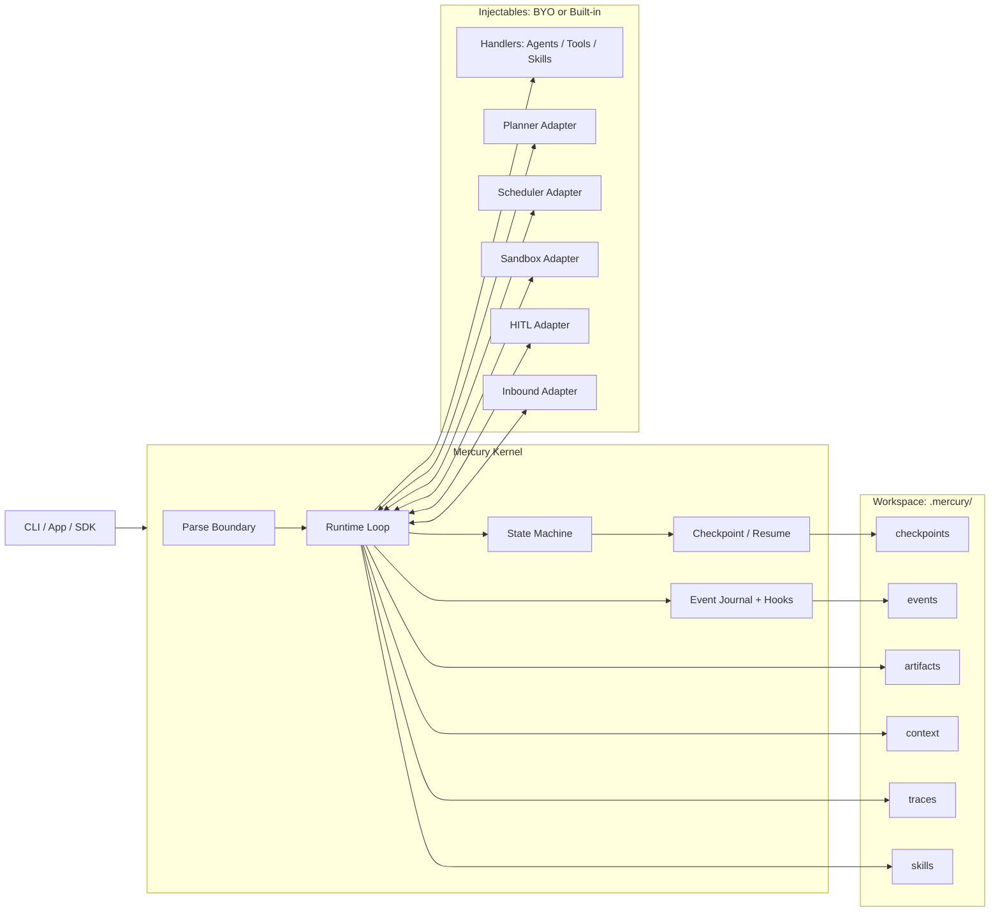
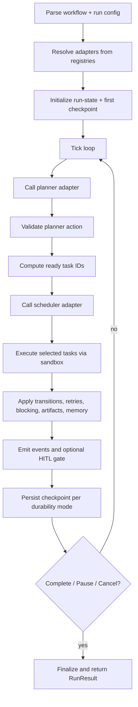
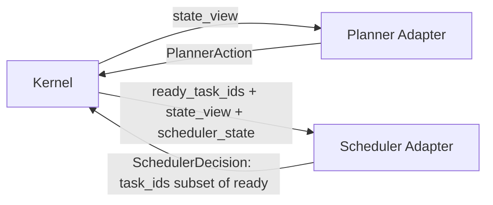

# Architecture

Mercury remains kernel-first internally. This document explains how the runtime separates the kernel from configurable adapters and how execution flows through checkpoints, events, and plugin seams.

## Kernel Responsibilities
- parse and validate workflow boundaries
- maintain run state and task lifecycle transitions
- enforce planner, scheduler, and runtime contracts
- own retries, blocking, cancellation, checkpointing, and resume
- persist checkpoints and event journals

## Extension Responsibilities
- handlers implement business behavior (agents/tools/skills)
- planners decide what to enqueue and when to complete
- schedulers choose among ready task IDs
- runtime plugins shape execution policy around the kernel

## Plugin Resolution
Mercury resolves planners, schedulers, sandboxes, and HITL adapters from `RuntimeRegistry` (see `mercura/runtime.py`). Each run calls `_resolve_plugins`, which types the configs, snapshots them for checkpoints, and keeps typed adapters (`_ResolvedPlugins`) ready for the tick loop.

## Execution Topology

## Runtime Tick Lifecycle

## Planner / Scheduler Contract Boundary

The diagrams synthesize how Mercury keeps the kernel small while letting adapters drive behavior.

## Checkpoint Writer
Mercury wraps checkpoint persistence inside `_CheckpointWriter` (`mercury/runtime.py:_CheckpointWriter`). It flushes checkpoints synchronously for `sync`/forced writes and batches writes asynchronously (or skips them in `exit` mode) while still saving the latest data before termination.
